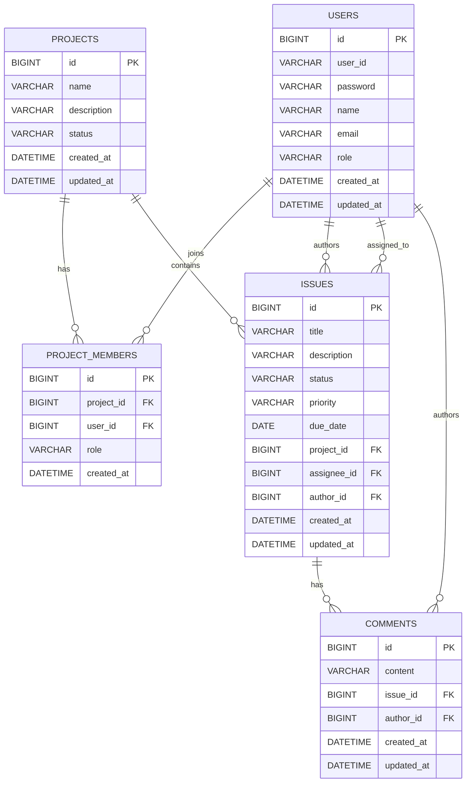

# Issue Tracker REST API

Spring Boot based REST API for managing projects, project members, issues, comments, users, authentication, authorization, token refresh, logout, and issue audit history.

This project is a personal backend portfolio project. It focuses on practical REST API design, layered architecture, validation, global exception handling, Spring Security, JWT authentication, refresh token management, project-member authorization, issue audit logging, Flyway database migration, testing, Swagger/OpenAPI documentation, Docker, Docker Compose, and CI.

---

## Table of Contents

- [Tech Stack](#tech-stack)
- [Project Overview](#project-overview)
- [Main Features](#main-features)
- [Authorization Policy](#authorization-policy)
- [Architecture](#architecture)
- [Entity Relationship Diagram](#entity-relationship-diagram)
- [API Endpoints](#api-endpoints)
- [Common Response Format](#common-response-format)
- [Environment Variables](#environment-variables)
- [How to Run Locally](#how-to-run-locally)
- [Docker Compose](#docker-compose)
- [Flyway Migration](#flyway-migration)
- [Testing](#testing)
- [CI](#ci)
- [Deployment Plan](#deployment-plan)
- [Future Improvements](#future-improvements)

---

## Tech Stack

| Category | Technology |
|---|---|
| Language | Java 17 |
| Framework | Spring Boot 4.0.6 |
| Build Tool | Maven |
| Web | Spring Web MVC |
| ORM | Spring Data JPA, Hibernate |
| Database | MySQL 8 |
| Migration | Flyway |
| Validation | Jakarta Validation |
| Security | Spring Security, JWT, BCrypt |
| API Docs | Swagger / OpenAPI |
| Testing | JUnit 5, Mockito, MockMvc, Spring Security Test, Testcontainers |
| Monitoring | Spring Boot Actuator |
| DevOps | Docker, Docker Compose |
| CI | GitHub Actions |

---

## Project Overview

Issue Tracker REST API provides backend features for a project-based issue tracking system.

Users can sign up, log in, refresh access tokens, log out, create projects, manage project members, create issues, assign issues, update issue status, track issue change history, write comments, and view project statistics. The project includes both global role-based authorization and project-level ownership/member authorization.

---

## Main Features

### Authentication

- User signup and login
- BCrypt password encoding
- JWT access token generation
- Refresh token storage and access token reissue
- Logout by refresh token revocation
- Stateless Bearer Token authentication
- Custom authentication and access-denied JSON responses
- Swagger Bearer Token authorization support

### Authorization

- `USER` and `ADMIN` role support
- `/api/users/**` restricted to `ADMIN`
- Project creator is automatically registered as project `OWNER`
- Project member-based project, issue, and comment access
- Project owner-based management rules
- Issue author and assignee based permissions
- Comment author based permissions

### Project

- Create, read, update, delete projects
- Project list filtered by membership for normal users
- Project stats API
- Project owner/member model

### Project Member

- List project members
- Add project member
- Remove project member
- Prevent duplicate members
- Prevent removing the project owner

### Issue

- Create, read, update, delete issues
- Search, filter, paginate, and sort issues
- Issue status update
- Issue assign and unassign
- Issue author tracking
- Assignee validation against project membership
- Issue status, priority, assignee, title, description, and due date change history

### Comment

- Create, read, update, delete comments
- Comment author tracking
- Project member-only comment access

### Infrastructure

- Common `ApiResponse`
- Validation and global exception handling
- Flyway schema migration
- Seed data for local demo accounts and issue examples
- Dockerfile
- Docker Compose for app + MySQL
- Production-oriented Docker Compose file
- GitHub Actions CI

---

## Authorization Policy

| Action | Allowed User |
|---|---|
| Access all resources | `ADMIN` |
| Create project | Authenticated `USER` or `ADMIN` |
| Project creator | Automatically registered as `OWNER` |
| List projects | `ADMIN` sees all, `USER` sees joined projects only |
| View project or project stats | Project member or `ADMIN` |
| Update/delete project | Project owner or `ADMIN` |
| Manage project members | Project owner or `ADMIN` |
| Create issue | Project member or `ADMIN` |
| View issue/search issues | Project member or `ADMIN` |
| Update/delete issue | Issue author, project owner, or `ADMIN` |
| Update issue status | Issue assignee, project owner, or `ADMIN` |
| Assign/unassign issue | Project owner or `ADMIN` |
| Create/view comment | Project member or `ADMIN` |
| Update/delete comment | Comment author, project owner, or `ADMIN` |
| Access `/api/users/**` | `ADMIN` only |

---

## Architecture

```text
Client / Swagger / Postman
        |
        v
Controller Layer
        |
        v
Service Layer
        |
        v
Repository Layer
        |
        v
MySQL Database
```

### Authentication Flow

```text
1. User signs up or logs in
2. Server validates credentials
3. Server returns JWT access token and refresh token
4. Client sends Authorization: Bearer <accessToken>
5. JwtAuthenticationFilter validates the access token
6. SecurityContext is populated
7. Client can request a new access token with the refresh token
8. Logout revokes the stored refresh token
9. Controller and service authorization rules are applied
```

More architecture notes:

- [Architecture Documentation](./docs/architecture.md)
- [Cloud Predeploy Checklist](./docs/cloud-predeploy-checklist.md)

---

## Entity Relationship Diagram

Detailed ERD document:

- [ERD Documentation](./docs/erd.md)



---

## API Endpoints

### Auth API

| Method | URL | Auth | Description |
|---|---|---|---|
| POST | `/api/auth/signup` | Public | Sign up |
| POST | `/api/auth/login` | Public | Login and receive access/refresh tokens |
| POST | `/api/auth/refresh` | Public | Reissue access token with refresh token |
| POST | `/api/auth/logout` | Public | Revoke refresh token |

### Project API

| Method | URL | Auth | Description |
|---|---|---|---|
| POST | `/api/projects` | Required | Create project |
| GET | `/api/projects` | Required | List accessible projects |
| GET | `/api/projects/{projectId}` | Required | Get project |
| PUT | `/api/projects/{projectId}` | Required | Update project |
| DELETE | `/api/projects/{projectId}` | Required | Delete project |
| GET | `/api/projects/{projectId}/stats` | Required | Get project stats |

### Project Member API

| Method | URL | Auth | Description |
|---|---|---|---|
| GET | `/api/projects/{projectId}/members` | Required | List project members |
| POST | `/api/projects/{projectId}/members` | Required | Add project member |
| DELETE | `/api/projects/{projectId}/members/{userId}` | Required | Remove project member |

Add member request:

```json
{
  "userId": 2
}
```

### Issue API

| Method | URL | Auth | Description |
|---|---|---|---|
| POST | `/api/projects/{projectId}/issues` | Required | Create issue |
| GET | `/api/projects/{projectId}/issues` | Required | List project issues |
| GET | `/api/projects/{projectId}/issues/page` | Required | Search/filter/page/sort issues |
| GET | `/api/issues/{issueId}` | Required | Get issue |
| PUT | `/api/issues/{issueId}` | Required | Update issue |
| DELETE | `/api/issues/{issueId}` | Required | Delete issue |
| PATCH | `/api/issues/{issueId}/status` | Required | Update issue status |
| PATCH | `/api/issues/{issueId}/assignee` | Required | Assign issue |
| DELETE | `/api/issues/{issueId}/assignee` | Required | Unassign issue |
| GET | `/api/issues/{issueId}/histories` | Required | List issue change history |

Create issue request:

```json
{
  "title": "Login API bug",
  "description": "Login API returns 500 error",
  "status": "TODO",
  "priority": "HIGH",
  "dueDate": "2026-06-30"
}
```

Search example:

```http
GET /api/projects/1/issues/page?status=TODO&priority=HIGH&keyword=login&page=0&size=10&sortBy=id&direction=desc
```

Assign issue request:

```json
{
  "assigneeId": 2
}
```

### Comment API

| Method | URL | Auth | Description |
|---|---|---|---|
| POST | `/api/issues/{issueId}/comments` | Required | Create comment |
| GET | `/api/issues/{issueId}/comments` | Required | List comments by issue |
| GET | `/api/comments/{commentId}` | Required | Get comment |
| PUT | `/api/comments/{commentId}` | Required | Update comment |
| DELETE | `/api/comments/{commentId}` | Required | Delete comment |

Create comment request:

```json
{
  "content": "This issue needs to be fixed first."
}
```

### User API

| Method | URL | Auth | Role | Description |
|---|---|---|---|---|
| POST | `/api/users` | Required | ADMIN | Create user |
| POST | `/api/users/admin` | Required | ADMIN | Create admin user |
| GET | `/api/users` | Required | ADMIN | List users |
| GET | `/api/users/{id}` | Required | ADMIN | Get user |
| PUT | `/api/users/{id}` | Required | ADMIN | Update user |
| DELETE | `/api/users/{id}` | Required | ADMIN | Delete user |

Normal registration should use `/api/auth/signup`.

---

## Common Response Format

All API responses use `ApiResponse`.

Success:

```json
{
  "success": true,
  "message": "Project created successfully.",
  "data": {
    "id": 1,
    "name": "Issue Tracker"
  }
}
```

Error:

```json
{
  "success": false,
  "message": "Access denied.",
  "data": null
}
```

Authentication and authorization errors:

| Case | Status |
|---|---|
| Missing token | `401 Unauthorized` |
| Invalid or expired token | `401 Unauthorized` |
| Insufficient role or permission | `403 Forbidden` |

---

## API Documentation

Swagger UI:

```text
http://localhost:8080/swagger-ui/index.html
```

OpenAPI JSON:

```text
http://localhost:8080/v3/api-docs
```

Use the Swagger **Authorize** button with:

```text
Bearer <accessToken>
```

---

## Environment Variables

The Docker Compose files read environment values from `.env`.

Example `.env`:

```env
APP_PORT=8080
MYSQL_PORT=3307

MYSQL_DATABASE=issue_tracker
MYSQL_ROOT_PASSWORD=change-this-root-password
MYSQL_USER=issue_user
MYSQL_PASSWORD=change-this-db-password

JWT_SECRET=replace-with-a-secure-random-secret-at-least-32-characters
JWT_EXPIRATION_MS=3600000
JWT_REFRESH_EXPIRATION_MS=1209600000

DDL_AUTO=validate

ADMIN_BOOTSTRAP_ENABLED=false
ADMIN_USER_ID=admin01
ADMIN_EMAIL=admin@example.com
ADMIN_NAME=Admin
ADMIN_PASSWORD=change-this-admin-password
```

Demo accounts inserted by Flyway sample data:

| Role | User ID | Password |
|---|---|---|
| ADMIN | `admin01` | `password` |
| Project Owner | `owner01` | `password` |
| Project Member | `member01` | `password` |

Notes:

- Do not commit real `.env` files.
- `JWT_SECRET` should be long and secure.
- `DDL_AUTO=validate` is recommended when using Flyway.
- `ADMIN_BOOTSTRAP_ENABLED=true` can create the first admin user. Disable it after initial setup.
- `MYSQL_PORT` is only the host port for local DB tools. Containers communicate with MySQL through `mysql:3306`.

---

## How to Run Locally

### 1. Start MySQL

Create the database:

```sql
CREATE DATABASE issue_tracker;
```

The default local profile uses:

```text
jdbc:mysql://127.0.0.1:3306/issue_tracker
username: root
password: root
```

Update [application-local.yaml](./src/main/resources/application-local.yaml) if your local MySQL credentials are different.

### 2. Run the Application

Windows:

```bash
mvnw.cmd spring-boot:run
```

macOS/Linux:

```bash
./mvnw spring-boot:run
```

### 3. Verify

```text
http://localhost:8080/actuator/health
http://localhost:8080/swagger-ui/index.html
```

---

## Docker Compose

Docker Compose is the recommended local execution path because it starts both the Spring Boot app and MySQL.

### Start

Build and run:

```bash
docker compose up -d --build
```

Run with an existing image:

```bash
docker compose up -d --no-build
```

### Stop

```bash
docker compose down
```

Remove containers and MySQL data volume:

```bash
docker compose down -v
```

`docker compose down -v` deletes all local MySQL data.

### Verify

```bash
docker compose ps
docker compose logs app
```

Health check:

```bash
curl http://localhost:8080/actuator/health
```

Expected:

```json
{
  "status": "UP"
}
```

### Docker Networking

Inside Docker Compose, the app connects to MySQL through the service name:

```text
jdbc:mysql://mysql:3306/issue_tracker
```

The host `MYSQL_PORT` is only for local tools such as MySQL Workbench or DBeaver.

---

## Production Compose

Production-like execution uses:

```bash
docker compose -f docker-compose.prod.yml up -d --build
```

Recommended production values:

```env
DDL_AUTO=validate
ADMIN_BOOTSTRAP_ENABLED=false
```

Use `ADMIN_BOOTSTRAP_ENABLED=true` only when bootstrapping the first admin account.

---

## Flyway Migration

Flyway is responsible for schema creation and migration.

Current migrations:

```text
src/main/resources/db/migration/V1__insert_table_sql.sql
src/main/resources/db/migration/V2__insert_sample_data.sql
src/main/resources/db/migration/V3__create_refresh_tokens.sql
src/main/resources/db/migration/V4__create_issue_histories.sql
```

Flyway naming rule:

```text
V<version>__<description>.sql
```

Examples:

```text
V1__insert_table_sql.sql
V2__insert_sample_data.sql
V3__create_refresh_tokens.sql
V4__create_issue_histories.sql
```

Important:

- Do not rename or edit an already-applied migration in shared or production databases.
- For local disposable Docker data, reset the DB with `docker compose down -v`.
- With Flyway enabled, Hibernate `ddl-auto=validate` should be used instead of `update`.

---

## Testing

Run all tests:

```bash
mvnw.cmd test
```

or:

```bash
./mvnw test
```

Current test coverage includes:

- Service layer unit tests
- Controller web layer tests
- Auth service/controller tests
- Security authorization tests
- Project member service/controller tests
- Issue and comment authorization tests
- Refresh token service/controller tests
- Testcontainers-based MySQL integration test
- Flyway migration validation against a real MySQL container

Current test count:

```text
102 tests
```

---

## CI

GitHub Actions workflow verifies:

- Java setup
- Maven tests
- Maven package
- Docker image build

Typical commands:

```bash
mvn -B test
mvn -B package -DskipTests
docker build -t issue-tracker-api:ci .
```

---

## Deployment Plan

Recommended portfolio deployment path:

```text
1. Local Docker Compose
2. AWS Lightsail, EC2, or low-cost VPS with Docker Compose
3. Optional Kubernetes practice using k3s, Minikube, kind, or cloud Kubernetes
```

Before deployment:

- Use strong secrets
- Set `DDL_AUTO=validate`
- Keep `.env` out of git
- Disable admin bootstrap after first setup
- Confirm `/actuator/health`
- Confirm Docker image build in CI

---

## Future Improvements

- Add file attachments
- Add labels or tags
- Add dashboard summary API
- Add production deployment guide
- Push Docker image to Docker Hub or GitHub Container Registry
- Add HTTPS/domain setup notes
- Add Kubernetes manifests

---

## Project Goal

The goal of this project is to demonstrate practical backend development with Java, Spring Boot, JPA, MySQL, REST API design, validation, exception handling, Spring Security, JWT, refresh token management, project-level authorization, issue audit logging, Flyway migration, testing, Swagger documentation, Docker, Docker Compose, CI, and deployment readiness.
