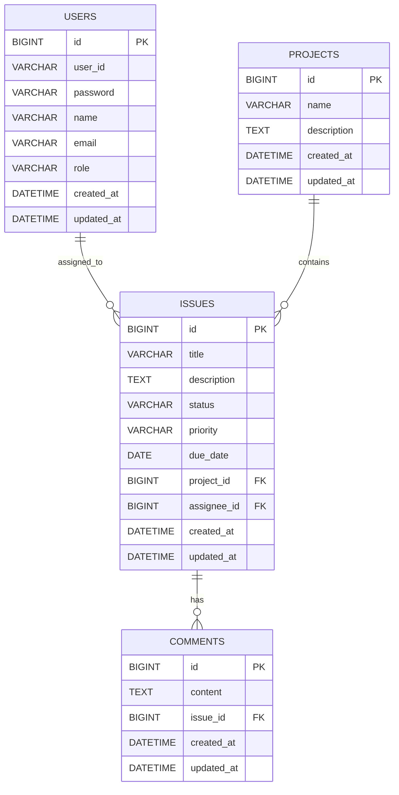

# Issue Tracker REST API

A Java + Spring Boot based REST API for managing projects, issues, comments, users, authentication, and authorization.

This project was built as a personal backend portfolio project. It focuses on REST API development, layered architecture, validation, exception handling, testing, API documentation, Spring Security, JWT authentication, Docker, Docker Compose, and GitHub Actions CI.

---

## Table of Contents

- [Tech Stack](#tech-stack)
- [Project Overview](#project-overview)
- [Main Features](#main-features)
- [Architecture](#architecture)
- [Entity Relationship Diagram](#entity-relationship-diagram)
- [Package Structure](#package-structure)
- [Authentication & Authorization](#authentication--authorization)
- [API Documentation](#api-documentation)
- [API Endpoints](#api-endpoints)
- [Environment Variables](#environment-variables)
- [How to Run Locally](#how-to-run-locally)
- [Docker Compose](#docker-compose)
- [Docker Only](#docker-only)
- [Docker Troubleshooting](#docker-troubleshooting)
- [Recommended Postman Test Flow](#recommended-postman-test-flow)
- [Testing](#testing)
- [CI](#ci)
- [Deployment Plan](#deployment-plan)
- [Completed Features](#completed-features)
- [Future Improvements](#future-improvements)
- [Project Goal](#project-goal)

---

## Tech Stack

| Category | Technology |
|---|---|
| Language | Java 17 |
| Framework | Spring Boot 4.0.6 |
| Build Tool | Maven |
| Web | Spring Web MVC |
| ORM | Spring Data JPA, Hibernate |
| Database | MySQL 8 |
| Validation | Jakarta Validation |
| Security | Spring Security, JWT, BCrypt |
| Utility | Lombok |
| Monitoring | Spring Boot Actuator |
| API Testing | Postman |
| Testing | JUnit 5, Mockito, MockMvc |
| API Docs | Swagger / OpenAPI |
| CI | GitHub Actions |
| DevOps | Docker, Docker Compose |
| Deployment Planned | AWS Lightsail, EC2, low-cost VPS, or Kubernetes |

---

## Project Overview

Issue Tracker REST API is a backend application for managing projects, issues, comments, and users.

The project started with core CRUD functionality and was gradually expanded with search, filtering, pagination, sorting, status changes, issue assignment, common response format, validation, exception handling, testing, Docker, Docker Compose, GitHub Actions CI, and JWT-based authentication.

---

## Main Features

### Authentication & Authorization

- User signup
- User login
- BCrypt password encryption
- JWT access token generation
- JWT authentication filter
- Bearer Token based protected API access
- Stateless authentication
- USER / ADMIN role support
- Role-based authorization
- Swagger Bearer Token authorization support

### Project

- Create project
- Get all projects
- Get project by ID
- Update project
- Delete project
- Get project issue statistics

### Issue

- Create issue
- Get issues by project
- Get issue by ID
- Update issue
- Delete issue
- Search and filter issues
- Pagination and sorting
- Update issue status
- Assign issue to user
- Unassign issue from user

### Comment

- Create comment
- Get comments by issue
- Get comment by ID
- Update comment
- Delete comment

### User

- Create user through signup
- Get all users
- Get user by ID
- Update user
- Delete user
- USER / ADMIN role management

### Common

- Common API response format
- Validation handling
- Global exception handling
- Entity relationships
- ERD documentation
- REST-style URL design
- Swagger / OpenAPI documentation
- GitHub Actions CI
- Dockerfile support
- Docker Compose support with MySQL
- MySQL volume persistence
- Environment variable separation with `.env` and `.env.example`

---

## Architecture

```text
Client / Postman / Swagger UI
        |
        v
Controller Layer
        |
        v
Service Layer
        |
        v
Repository Layer
        |
        v
MySQL Database
```

### Authentication Flow

```text
1. Client signs up or logs in
2. Server validates user credentials
3. Server returns JWT access token
4. Client sends token in Authorization header
5. JwtAuthenticationFilter validates the token
6. SecurityContext is populated
7. Protected API is executed based on user role
```

---

## Entity Relationship Diagram

The ERD is also available as a separate document:

- [ERD Documentation](./docs/erd.md)



### Entity Relationships

```text
Project 1 : N Issue
Issue   N : 1 Project
Issue   N : 1 User      // assignee
Issue   1 : N Comment
User    1 : N Issue
```

### Relationship Notes

- A project can have multiple issues.
- An issue belongs to one project.
- An issue can have one assigned user.
- A user can be assigned to multiple issues.
- A comment belongs to one issue.
- Issue author and comment author relationships are not included yet because they are planned as future improvements.

---

## Package Structure

```text
com.example.issuetracker
 ├── config
 ├── controller
 ├── dto
 ├── dto.request
 ├── dto.response
 ├── entity
 ├── exception
 ├── repository
 ├── response
 ├── security
 ├── service
 └── serviceImpl
```

---

## Common API Response Format

All API responses use a common response wrapper called `ApiResponse`.

### Success Response Example

```json
{
  "success": true,
  "message": "Project created successfully.",
  "data": {
    "id": 1,
    "name": "Issue Tracker",
    "description": "Issue tracker project"
  }
}
```

### Error Response Example

```json
{
  "success": false,
  "message": "Project not found.",
  "data": null
}
```

---

# Authentication & Authorization

This project uses Spring Security with JWT-based stateless authentication.

## Auth Flow

```text
Signup -> Login -> JWT Access Token -> Bearer Token -> Protected API
```

## Authorization Header

Protected APIs require the following HTTP header:

```http
Authorization: Bearer <accessToken>
```

## Roles

| Role | Description |
|---|---|
| USER | Basic authenticated user |
| ADMIN | Administrator with access to user management or admin APIs |

## Public APIs

| Method | URL | Description |
|---|---|---|
| POST | `/api/auth/signup` | Sign up |
| POST | `/api/auth/login` | Login |
| GET | `/swagger-ui/**` | Swagger UI |
| GET | `/v3/api-docs/**` | OpenAPI docs |
| GET | `/actuator/health` | Health check |

## Protected APIs

Most project, issue, comment, and user-related APIs require a valid JWT access token.

| Token / Role | Result |
|---|---|
| No token | `401 Unauthorized` |
| Invalid or expired token | `401 Unauthorized` |
| USER token | Can access normal protected APIs |
| USER token on ADMIN API | `403 Forbidden` |
| ADMIN token | Can access user management APIs |

---

# API Documentation

## Swagger / OpenAPI

Swagger UI:

```text
http://localhost:8080/swagger-ui/index.html
```

OpenAPI JSON:

```text
http://localhost:8080/v3/api-docs
```

## Swagger JWT Authorization

Swagger UI supports JWT Bearer authentication.

### How to Use

1. Create a user using `/api/auth/signup`.
2. Login using `/api/auth/login`.
3. Copy the `accessToken` from the login response.
4. Click the **Authorize** button in Swagger UI.
5. Paste the token value.
6. Call protected APIs from Swagger UI.

Swagger will automatically send the following header for protected API requests:

```http
Authorization: Bearer <accessToken>
```

### Authorization Test Cases

| Test Case | Expected Result |
|---|---|
| Call protected API without token | `401 Unauthorized` |
| Call protected API with valid USER token | Success |
| Call ADMIN API with USER token | `403 Forbidden` |
| Call ADMIN API with ADMIN token | Success |

---

# API Endpoints

## Auth API

| Method | URL | Auth Required | Description |
|---|---|---|---|
| POST | `/api/auth/signup` | No | Sign up |
| POST | `/api/auth/login` | No | Login and receive JWT access token |

### Signup

```http
POST /api/auth/signup
```

Request body:

```json
{
  "userId": "user01",
  "password": "password1234",
  "name": "John Doe",
  "email": "john@example.com"
}
```

Response example:

```json
{
  "success": true,
  "message": "Signup successful.",
  "data": {
    "id": 1,
    "userId": "user01",
    "name": "John Doe",
    "email": "john@example.com",
    "role": "USER"
  }
}
```

### Login

```http
POST /api/auth/login
```

Request body:

```json
{
  "userId": "user01",
  "password": "password1234"
}
```

Response example:

```json
{
  "success": true,
  "message": "Login successful.",
  "data": {
    "accessToken": "jwt-access-token"
  }
}
```

---

## Project API

| Method | URL | Auth Required | Role | Description |
|---|---|---|---|---|
| POST | `/api/projects` | Yes | USER, ADMIN | Create a project |
| GET | `/api/projects` | Yes | USER, ADMIN | Get all projects |
| GET | `/api/projects/{projectId}` | Yes | USER, ADMIN | Get a project by ID |
| PUT | `/api/projects/{projectId}` | Yes | USER, ADMIN | Update a project |
| DELETE | `/api/projects/{projectId}` | Yes | USER, ADMIN | Delete a project |
| GET | `/api/projects/{projectId}/stats` | Yes | USER, ADMIN | Get project issue statistics |

### Create Project

```http
POST /api/projects
Authorization: Bearer <accessToken>
```

Request body:

```json
{
  "name": "Issue Tracker",
  "description": "Issue tracker REST API project"
}
```

Response example:

```json
{
  "success": true,
  "message": "Project created successfully.",
  "data": {
    "id": 1,
    "name": "Issue Tracker",
    "description": "Issue tracker REST API project"
  }
}
```

### Get Project Statistics

```http
GET /api/projects/{projectId}/stats
Authorization: Bearer <accessToken>
```

Response example:

```json
{
  "success": true,
  "message": "Project stats retrieved successfully.",
  "data": {
    "projectId": 1,
    "projectName": "Issue Tracker",
    "totalIssues": 10,
    "todoCount": 3,
    "inProgressCount": 4,
    "doneCount": 3
  }
}
```

---

## Issue API

| Method | URL | Auth Required | Role | Description |
|---|---|---|---|---|
| POST | `/api/projects/{projectId}/issues` | Yes | USER, ADMIN | Create an issue |
| GET | `/api/projects/{projectId}/issues` | Yes | USER, ADMIN | Get issues by project |
| GET | `/api/issues/{issueId}` | Yes | USER, ADMIN | Get an issue by ID |
| PUT | `/api/issues/{issueId}` | Yes | USER, ADMIN | Update an issue |
| DELETE | `/api/issues/{issueId}` | Yes | USER, ADMIN | Delete an issue |
| GET | `/api/projects/{projectId}/issues/page` | Yes | USER, ADMIN | Search, filter, paginate, and sort issues |
| PATCH | `/api/issues/{issueId}/status` | Yes | USER, ADMIN | Update issue status |
| PATCH | `/api/issues/{issueId}/assignee` | Yes | USER, ADMIN | Assign issue to user |
| DELETE | `/api/issues/{issueId}/assignee` | Yes | USER, ADMIN | Unassign issue from user |

### Create Issue

```http
POST /api/projects/{projectId}/issues
Authorization: Bearer <accessToken>
```

Request body:

```json
{
  "title": "Login API bug",
  "description": "Login API returns 500 error",
  "priority": "HIGH",
  "dueDate": "2026-06-30"
}
```

### Search, Filter, Paginate, and Sort Issues

```http
GET /api/projects/{projectId}/issues/page
Authorization: Bearer <accessToken>
```

Query parameter example:

```http
GET /api/projects/1/issues/page?page=0&size=10&sortBy=id&direction=desc
```

Filter example:

```http
GET /api/projects/1/issues/page?status=TODO&priority=HIGH&page=0&size=10&sortBy=id&direction=desc
```

### Update Issue Status

```http
PATCH /api/issues/{issueId}/status
Authorization: Bearer <accessToken>
```

Request body:

```json
{
  "status": "IN_PROGRESS"
}
```

Available status values:

```text
TODO
IN_PROGRESS
DONE
```

### Assign Issue to User

```http
PATCH /api/issues/{issueId}/assignee
Authorization: Bearer <accessToken>
```

Request body:

```json
{
  "userId": 1
}
```

### Unassign Issue from User

```http
DELETE /api/issues/{issueId}/assignee
Authorization: Bearer <accessToken>
```

---

## Comment API

| Method | URL | Auth Required | Role | Description |
|---|---|---|---|---|
| POST | `/api/issues/{issueId}/comments` | Yes | USER, ADMIN | Create a comment |
| GET | `/api/issues/{issueId}/comments` | Yes | USER, ADMIN | Get comments by issue |
| GET | `/api/comments/{commentId}` | Yes | USER, ADMIN | Get a comment by ID |
| PUT | `/api/comments/{commentId}` | Yes | USER, ADMIN | Update a comment |
| DELETE | `/api/comments/{commentId}` | Yes | USER, ADMIN | Delete a comment |

### Create Comment

```http
POST /api/issues/{issueId}/comments
Authorization: Bearer <accessToken>
```

Request body:

```json
{
  "content": "This issue needs to be fixed first."
}
```

### Update Comment

```http
PUT /api/comments/{commentId}
Authorization: Bearer <accessToken>
```

Request body:

```json
{
  "content": "Updated comment content."
}
```

---

## User API

User APIs are protected APIs.  
For a production-like project, user management APIs should be restricted to ADMIN role.

| Method | URL | Auth Required | Role | Description |
|---|---|---|---|---|
| GET | `/api/users` | Yes | ADMIN | Get all users |
| GET | `/api/users/{userId}` | Yes | ADMIN | Get a user by ID |
| PUT | `/api/users/{userId}` | Yes | ADMIN | Update a user |
| DELETE | `/api/users/{userId}` | Yes | ADMIN | Delete a user |

> Note: Normal user registration should be handled through `/api/auth/signup`.

---

# Environment Variables

This project separates environment-specific values using `.env`.

## `.env.example`

```env
APP_PORT=8080

MYSQL_DATABASE=issue_tracker
MYSQL_ROOT_PASSWORD=root
MYSQL_USER=issue_user
MYSQL_PASSWORD=issue_password
MYSQL_PORT=3307

JWT_SECRET=replace-with-your-own-secret-key-at-least-32-characters
JWT_EXPIRATION_MS=3600000
```

## Important Notes

- Do not commit real `.env` files.
- Commit `.env.example` only.
- Use a long and secure `JWT_SECRET`.
- Change database passwords for production.
- `docker compose down -v` removes the MySQL volume and deletes all database data.

---

# How to Run Locally

## 1. Clone the Repository

```bash
git clone https://github.com/your-username/issue-tracker-api.git
cd issue-tracker-api
```

## 2. Create MySQL Database

```sql
CREATE DATABASE issue_tracker;
```

## 3. Configure Database Settings

Example `application.yml`:

```yaml
server:
  port: 8080

spring:
  application:
    name: issue-tracker-api

  datasource:
    url: jdbc:mysql://localhost:3306/issue_tracker?serverTimezone=Asia/Seoul&characterEncoding=UTF-8&allowPublicKeyRetrieval=true&useSSL=false
    username: root
    password: root
    driver-class-name: com.mysql.cj.jdbc.Driver

  jpa:
    hibernate:
      ddl-auto: update
    show-sql: true
    open-in-view: false
    properties:
      hibernate:
        format_sql: true

jwt:
  secret: ${JWT_SECRET:default-secret-key-default-secret-key-123456}
  expiration-ms: ${JWT_EXPIRATION_MS:3600000}

management:
  endpoints:
    web:
      exposure:
        include: health,info,metrics
  endpoint:
    health:
      show-details: always
```

Update `username`, `password`, and database name based on your local MySQL environment.

## 4. Run the Application

Using Maven Wrapper:

```bash
./mvnw spring-boot:run
```

On Windows:

```bash
mvnw.cmd spring-boot:run
```

Or using local Maven:

```bash
mvn spring-boot:run
```

Or run the main class from your IDE:

```text
IssueTrackerApiApplication.java
```

## 5. Check Server Status

Base URL:

```text
http://localhost:8080
```

Actuator health check:

```http
GET /actuator/health
```

Swagger UI:

```text
http://localhost:8080/swagger-ui/index.html
```

OpenAPI JSON:

```text
http://localhost:8080/v3/api-docs
```

---

# Docker Compose

Docker Compose is the recommended way to run this project locally because it starts both the Spring Boot application and MySQL together.

Docker Compose starts:

- Spring Boot API container
- MySQL 8 container
- Persistent MySQL volume

## Docker Compose Services

| Service | Description |
|---|---|
| `app` | Spring Boot application container |
| `mysql` | MySQL 8 database container |

## Database Connection in Docker Compose

The application connects to MySQL using the Docker Compose service name:

```text
jdbc:mysql://mysql:3306/issue_tracker
```

The MySQL container is exposed to the local machine on port `3307` to avoid conflicts with a locally installed MySQL server.

```text
Local MySQL access: localhost:3307
Docker network access: mysql:3306
```

## Start Containers

Build and start containers:

```bash
docker compose up --build
```

Start containers in detached mode:

```bash
docker compose up -d --build
```

## Stop Containers

Stop and remove containers:

```bash
docker compose down
```

Stop containers and remove the MySQL volume:

```bash
docker compose down -v
```

> Warning: `docker compose down -v` removes the MySQL volume and deletes all persisted database data.

## Check Running Containers

```bash
docker ps
```

Expected containers:

```text
issue-tracker-api-app-1
issue-tracker-api-mysql-1
```

## Check Logs

Check all logs:

```bash
docker compose logs
```

Check application logs:

```bash
docker compose logs app
```

Check MySQL logs:

```bash
docker compose logs mysql
```

Follow application logs:

```bash
docker compose logs -f app
```

## Database Information

| Item | Value |
|---|---|
| Database | `issue_tracker` |
| MySQL Docker service | `mysql` |
| MySQL container port | `3306` |
| MySQL local port | `3307` |
| JDBC URL in Docker | `jdbc:mysql://mysql:3306/issue_tracker` |
| Volume | `mysql_data` |

## Access MySQL from Local Tools

For tools like MySQL Workbench or DBeaver:

```text
Host: localhost
Port: 3307
Username: root
Password: root
Database: issue_tracker
```

## Verify Application

Swagger UI:

```text
http://localhost:8080/swagger-ui/index.html
```

OpenAPI Docs:

```text
http://localhost:8080/v3/api-docs
```

Actuator Health:

```text
http://localhost:8080/actuator/health
```

Expected health response:

```json
{
  "status": "UP"
}
```

---

# Docker Only

Docker Compose is recommended for normal local testing.  
This Docker-only option is useful when MySQL is already running on your local machine.

## Build Docker Image

```bash
docker build -t issue-tracker-api:latest .
```

## Run Docker Container with Local MySQL

When running the application inside a Docker container, use `host.docker.internal` instead of `localhost` to connect to MySQL running on your local machine.

```bash
docker run --name issue-tracker-api-container -p 8080:8080 \
  -e SPRING_DATASOURCE_URL="jdbc:mysql://host.docker.internal:3306/issue_tracker?serverTimezone=Asia/Seoul&characterEncoding=UTF-8&allowPublicKeyRetrieval=true&useSSL=false" \
  -e SPRING_DATASOURCE_USERNAME="root" \
  -e SPRING_DATASOURCE_PASSWORD="root" \
  -e JWT_SECRET="replace-with-your-own-secret-key-at-least-32-characters" \
  -e JWT_EXPIRATION_MS="3600000" \
  issue-tracker-api:latest
```

One-line command:

```bash
docker run --name issue-tracker-api-container -p 8080:8080 -e SPRING_DATASOURCE_URL="jdbc:mysql://host.docker.internal:3306/issue_tracker?serverTimezone=Asia/Seoul&characterEncoding=UTF-8&allowPublicKeyRetrieval=true&useSSL=false" -e SPRING_DATASOURCE_USERNAME="root" -e SPRING_DATASOURCE_PASSWORD="root" -e JWT_SECRET="replace-with-your-own-secret-key-at-least-32-characters" -e JWT_EXPIRATION_MS="3600000" issue-tracker-api:latest
```

## Docker Commands

Check running containers:

```bash
docker ps
```

Check all containers:

```bash
docker ps -a
```

Stop the container:

```bash
docker stop issue-tracker-api-container
```

Start the container again:

```bash
docker start issue-tracker-api-container
```

View logs:

```bash
docker logs -f issue-tracker-api-container
```

Remove the container:

```bash
docker rm issue-tracker-api-container
```

Force remove the container:

```bash
docker rm -f issue-tracker-api-container
```

---

# Docker Troubleshooting

## Port 3306 is Already in Use

If MySQL is already running on the local machine, Docker may fail with:

```text
ports are not available: exposing port TCP 0.0.0.0:3306
```

This project uses local port `3307` for the MySQL container:

```yaml
ports:
  - "3307:3306"
```

The Spring Boot application still uses the Docker Compose service name and container port:

```text
jdbc:mysql://mysql:3306/issue_tracker
```

This is because containers communicate through the Docker Compose network.

## Port 8080 is Already in Use

Check running containers:

```bash
docker ps
```

Remove an old standalone container if needed:

```bash
docker rm -f issue-tracker-api-container
```

Or stop Docker Compose containers:

```bash
docker compose down
```

## MySQL Connection Refused

This can happen if the Spring Boot application starts before MySQL is ready.

The project uses MySQL `healthcheck` and `depends_on` to wait until MySQL is healthy before starting the application.

## Access Denied for User Root

Check that the MySQL password and Spring datasource password match.

If the MySQL volume was already created with a different password, reset the volume:

```bash
docker compose down -v
docker compose up --build
```

> Warning: this deletes the existing MySQL data.

## Unknown Database `issue_tracker`

Check that the compose file contains:

```yaml
MYSQL_DATABASE: issue_tracker
```

If the database was not created correctly during the first initialization, reset the volume:

```bash
docker compose down -v
docker compose up --build
```

> Warning: this deletes the existing MySQL data.

## Admin Account Reset After Removing Volume

If you run:

```bash
docker compose down -v
```

the MySQL volume is deleted, so all users and admin accounts are removed.

For local development, create users again through `/api/auth/signup`.  
For admin users, use your configured admin creation method or insert a local test admin account directly into the database only in a local development environment.

---

# Recommended Postman Test Flow

Because most APIs are protected by JWT authentication, login should be tested first.

## Test Flow

1. Sign up
2. Login
3. Copy JWT access token
4. Add `Authorization: Bearer <accessToken>` header
5. Create project
6. Create issue
7. Assign issue to user
8. Update issue status
9. Create comment
10. Get project statistics
11. Test issue search, filtering, pagination, and sorting
12. Test update APIs
13. Test delete APIs
14. Test protected API without token
15. Test protected API with invalid token
16. Test USER / ADMIN role authorization

## Test Flow Example

### 1. Sign Up

```http
POST /api/auth/signup
```

Request body:

```json
{
  "userId": "user01",
  "password": "password1234",
  "name": "John Doe",
  "email": "john@example.com"
}
```

### 2. Login

```http
POST /api/auth/login
```

Request body:

```json
{
  "userId": "user01",
  "password": "password1234"
}
```

### 3. Set Authorization Header

```http
Authorization: Bearer <accessToken>
```

### 4. Create Project

```http
POST /api/projects
```

### 5. Create Issue

```http
POST /api/projects/{projectId}/issues
```

### 6. Assign Issue

```http
PATCH /api/issues/{issueId}/assignee
```

### 7. Update Issue Status

```http
PATCH /api/issues/{issueId}/status
```

### 8. Create Comment

```http
POST /api/issues/{issueId}/comments
```

### 9. Check Project Statistics

```http
GET /api/projects/{projectId}/stats
```

### 10. Test Unauthorized Request

Call a protected API without token:

```http
GET /api/projects
```

Expected result:

```text
401 Unauthorized
```

### 11. Test Forbidden Request

Call an ADMIN-only API with a USER token.

Expected result:

```text
403 Forbidden
```

---

# Testing

This project includes Service Layer Unit Tests, Controller Web Layer Tests, authentication tests, and authorization tests.

## Service Layer Unit Tests

Service layer tests verify the business logic of each service implementation without starting the full Spring Boot application context.

Tested classes:

- `ProjectServiceImplTest`
- `UserServiceImplTest`
- `CommentServiceImplTest`
- `IssueServiceImplTest`
- `AuthServiceImplTest`

Main tools:

- JUnit 5
- Mockito
- `@ExtendWith(MockitoExtension.class)`
- Mocked repository dependencies

These tests focus on validating service logic such as creating, updating, deleting, finding resources, assigning users to issues, authentication, password encoding, JWT token generation, and handling not-found or invalid-credential cases.

## Controller Web Layer Tests

Controller tests verify REST API request and response behavior using MockMvc.

Tested classes:

- `ProjectControllerTest`
- `UserControllerTest`
- `CommentControllerTest`
- `IssueControllerTest`
- `AuthControllerTest`
- `SecurityAuthorizationTest`

Main tools:

- JUnit 5
- Mockito
- MockMvc
- `@WebMvcTest`
- JSON response validation with `jsonPath`
- Spring Security test support

These tests focus on verifying HTTP status codes, request mappings, validation behavior, common API response structures, authentication behavior, authorization behavior, and security-aware controller behavior.

## Running Tests

Run all tests:

```bash
./mvnw test
```

On Windows:

```bash
mvnw.cmd test
```

Or using local Maven:

```bash
mvn test
```

---

# CI

This project uses GitHub Actions to run automated checks.

Workflow file:

```text
.github/workflows/ci.yml
```

The CI workflow verifies:

- Source checkout
- Java setup
- Maven dependency resolution
- Test execution
- Application packaging
- Docker image build

Main commands:

```bash
mvn -B test
mvn -B package -DskipTests
docker build -t issue-tracker-api:ci .
```

The CI workflow runs automatically on push or pull request based on the workflow configuration.

---

# Deployment Plan

The recommended deployment path for this project is:

```text
1. Local Docker Compose
2. AWS Lightsail or low-cost VPS with Docker Compose
3. Optional Kubernetes practice using k3s, Minikube, or cloud Kubernetes
```

## Recommended First Deployment Target

For portfolio purposes, deploying this project with Docker Compose on AWS Lightsail, EC2, or a low-cost VPS is recommended first.

Reason:

- The project already supports Docker Compose
- Spring Boot app and MySQL can run together on one server
- Deployment process is easier to explain
- It is more realistic than jumping directly to Kubernetes
- It demonstrates practical backend deployment experience

## Kubernetes Plan

Kubernetes can be added later as an advanced deployment step.

Recommended Kubernetes learning path:

```text
1. Create Kubernetes manifests
2. Run locally with Minikube or kind
3. Try lightweight k3s on VPS
4. Consider EKS only if needed
```

---

# Completed Features

- Project CRUD
- Issue CRUD
- Issue search and filtering
- Issue pagination and sorting
- Issue status update
- Issue priority enum
- Issue assignee assignment and unassignment
- Comment CRUD
- User CRUD
- Project issue statistics
- Common API response format
- Global exception handling
- Validation handling
- REST-style API URL structure
- Spring Security integration
- BCrypt password encoding
- User signup API
- User login API
- JWT access token generation
- JWT authentication filter
- Bearer Token based protected API access
- USER / ADMIN role-based authorization
- Login failure handling with `401 Unauthorized`
- Swagger / OpenAPI documentation
- Swagger Bearer Token authentication support
- ERD documentation
- Postman testing
- Docker Compose based Postman testing
- Service layer unit tests
- Controller web layer tests
- Security-aware controller tests
- Auth service tests
- Auth controller tests
- Authorization tests
- GitHub Actions CI
- GitHub Actions test verification
- GitHub Actions Docker build verification
- Dockerfile
- Docker image build verification
- Docker container run verification
- Docker Compose setup with Spring Boot and MySQL
- MySQL volume persistence verification
- Docker Compose restart verification
- Environment variable separation with `.env` and `.env.example`

---

# Future Improvements

## Authentication and Authorization

- Add refresh token support
- Add logout or token blacklist
- Add permission rules based on author or assignee
- Add project member-based access control
- Add token expiration handling tests

## DevOps

- Deploy to AWS Lightsail, EC2, or a low-cost VPS
- Add production deployment guide
- Add HTTPS and domain configuration
- Move production secrets to server environment variables or secret manager
- Add Docker image push to Docker Hub or GitHub Container Registry
- Practice Kubernetes deployment with k3s, Minikube, or cloud Kubernetes

## Documentation

- Add architecture diagram image
- Add more request and response examples
- Add deployment screenshots
- Add troubleshooting examples based on real deployment errors

## Feature Expansion

- Add issue author field
- Add comment author field
- Add issue history tracking
- Add file attachments
- Add due date notification
- Add project member management
- Add issue labels or tags
- Add dashboard summary API

---

# Project Goal

The goal of this project is to build a practical issue tracking REST API, starting from core CRUD features and gradually expanding into authentication, authorization, testing, Docker, CI/CD, and deployment.

This project is designed to demonstrate backend development skills using Java, Spring Boot, JPA, MySQL, REST API design, validation, exception handling, Spring Security, JWT, testing, API documentation, Docker, Docker Compose, GitHub Actions, and layered architecture.
