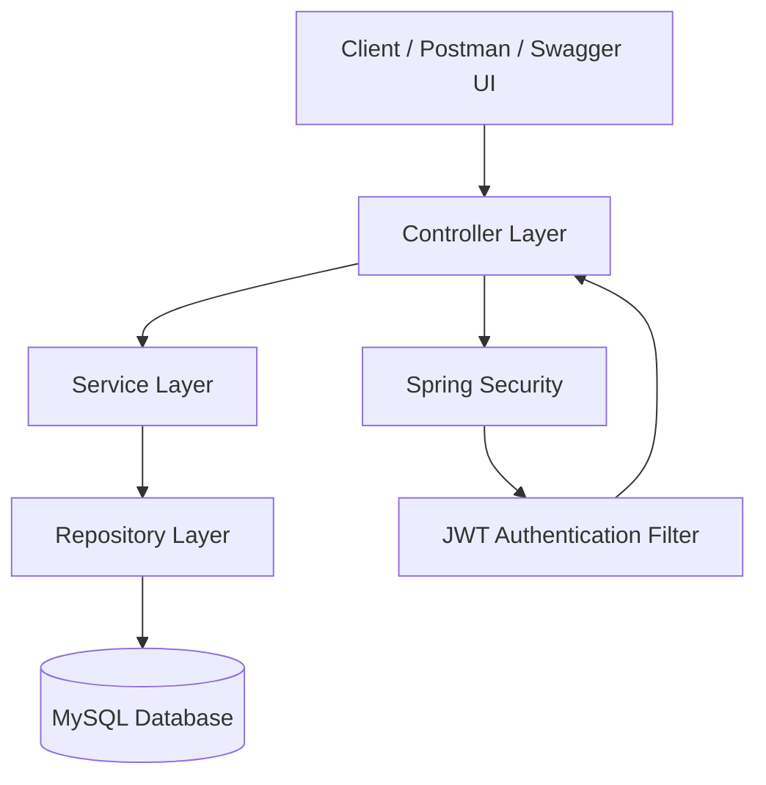
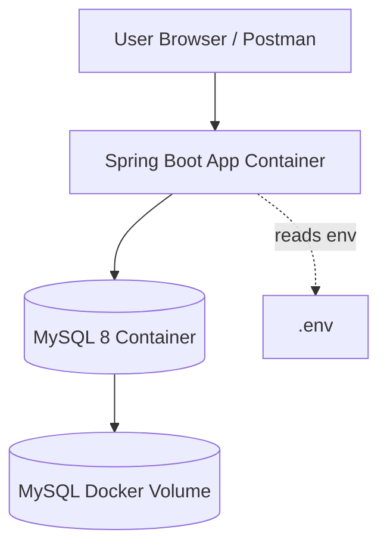
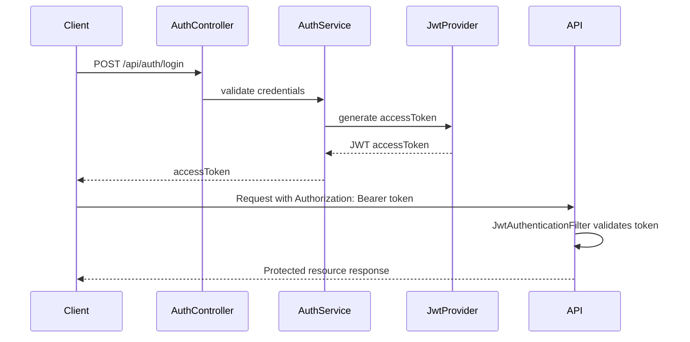

# Architecture

This document describes the overall architecture of the Issue Tracker API.

## System Architecture

## Docker Compose Architecture

## Authentication Flow

## Layer Responsibilities

| Layer | Responsibility |
|---|---|
| Controller | Handles HTTP requests and responses |
| Service | Contains business logic |
| Repository | Handles database access through Spring Data JPA |
| Entity | Represents database tables |
| DTO | Transfers request and response data |
| Security | Handles JWT authentication and role-based authorization |
| Database | Stores users, projects, issues, and comments |
