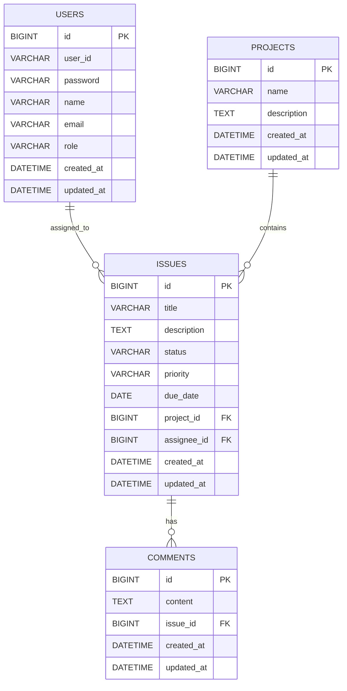

# ERD

This document describes the database structure of the Issue Tracker API.

## Entity Relationship Diagram



## Relationships

### User - Issue

A user can be assigned to multiple issues.

```text
USERS 1 : N ISSUES
```

### Project - Issue

A project can contain multiple issues.

```text
PROJECTS 1 : N ISSUES
```

### Issue - Comment

An issue can have multiple comments.

```text
ISSUES 1 : N COMMENTS
```

## Notes

- `USERS.role` is used for role-based authorization.
- `ISSUES.status` is used for issue workflow management.
- `ISSUES.priority` is used to manage issue priority.
- `ISSUES.due_date` is used to manage the issue deadline.
- `ISSUES.assignee_id` is nullable when an issue is not assigned to any user.
- Author relationships for issues or comments are not included because they are listed as future improvements, not current completed features.