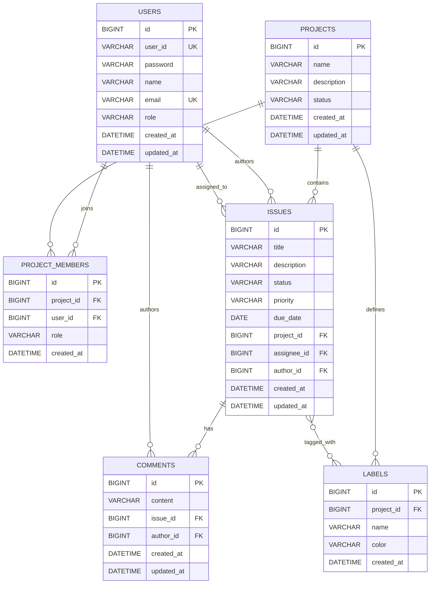

# ERD

This document describes the current database structure of the Issue Tracker API.

## Entity Relationship Diagram



## Relationships

### User - Project Member

A user can join multiple projects through `project_members`.

```text
USERS 1 : N PROJECT_MEMBERS
```

### Project - Project Member

A project can have multiple members. A project member has a project-level role: `OWNER` or `MEMBER`.

```text
PROJECTS 1 : N PROJECT_MEMBERS
```

### Project - Issue

A project can contain multiple issues.

```text
PROJECTS 1 : N ISSUES
```

### User - Issue Author

A user can author multiple issues. `ISSUES.author_id` is required.

```text
USERS 1 : N ISSUES
```

### User - Issue Assignee

A user can be assigned to multiple issues. `ISSUES.assignee_id` is nullable.

```text
USERS 1 : N ISSUES
```

### Issue - Comment

An issue can have multiple comments.

```text
ISSUES 1 : N COMMENTS
```

### Project - Label

A project can define multiple labels. Label names are unique within a project.

```text
PROJECTS 1 : N LABELS
```

### Issue - Label

An issue can have multiple labels, and a label can be attached to multiple issues through `issue_labels`.

```text
ISSUES N : M LABELS
```

### User - Comment Author

A user can author multiple comments. `COMMENTS.author_id` is required.

```text
USERS 1 : N COMMENTS
```

## Constraints

- `USERS.user_id` is unique.
- `USERS.email` is unique.
- `PROJECT_MEMBERS(project_id, user_id)` is unique.
- `ISSUES.project_id` references `PROJECTS.id`.
- `ISSUES.assignee_id` references `USERS.id` and is nullable.
- `ISSUES.author_id` references `USERS.id` and is required.
- `COMMENTS.issue_id` references `ISSUES.id`.
- `COMMENTS.author_id` references `USERS.id` and is required.
- `PROJECT_MEMBERS.project_id` references `PROJECTS.id`.
- `PROJECT_MEMBERS.user_id` references `USERS.id`.
- `LABELS.project_id` references `PROJECTS.id`.
- `LABELS(project_id, name)` is unique.
- `ISSUE_LABELS(issue_id, label_id)` is the primary key.
- `ISSUE_LABELS.issue_id` references `ISSUES.id`.
- `ISSUE_LABELS.label_id` references `LABELS.id`.

## Notes

- `USERS.role` is used for global role-based authorization: `USER` or `ADMIN`.
- `PROJECT_MEMBERS.role` is used for project-level authorization: `OWNER` or `MEMBER`.
- `ISSUES.status` is used for issue workflow management.
- `ISSUES.priority` is used to manage issue priority.
- `ISSUES.due_date` is used to manage the issue deadline.
- `LABELS.color` stores a hex color value for API clients.
